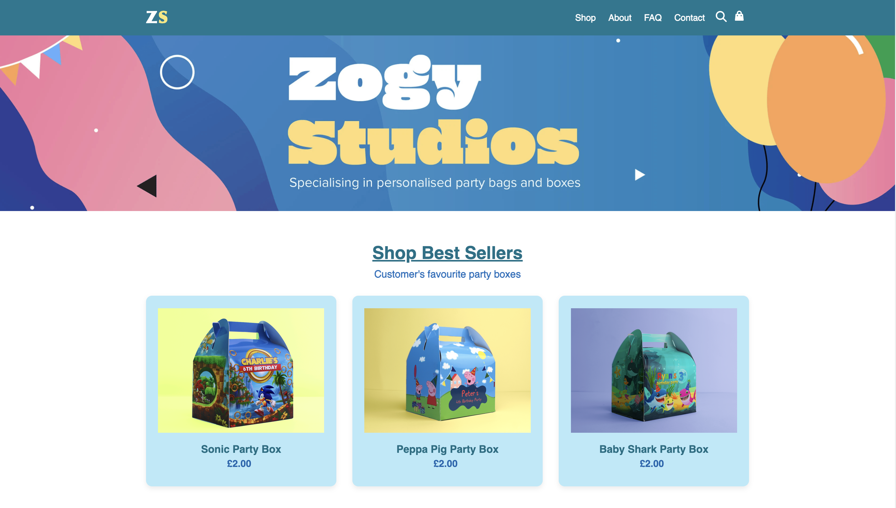
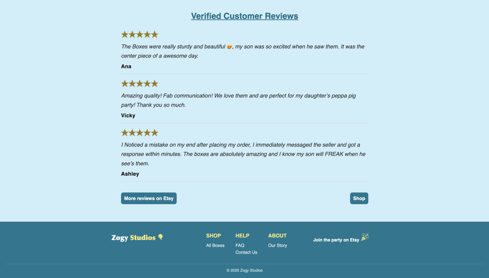
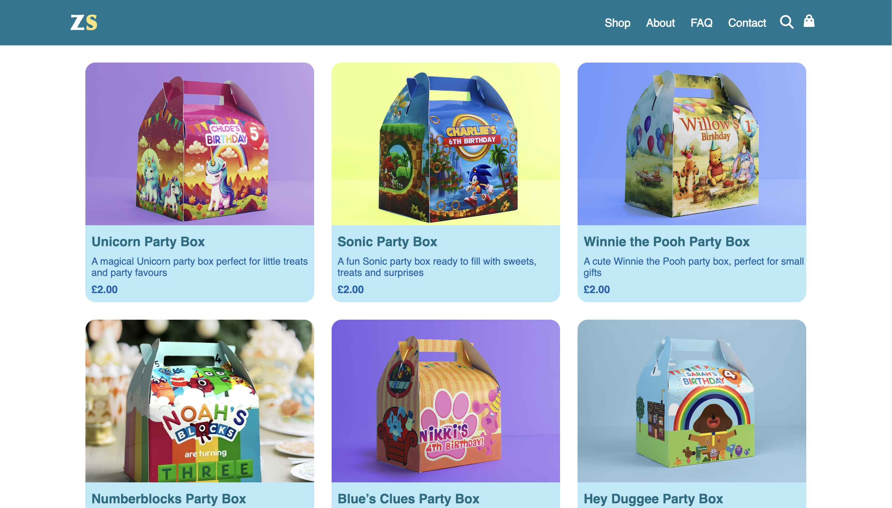
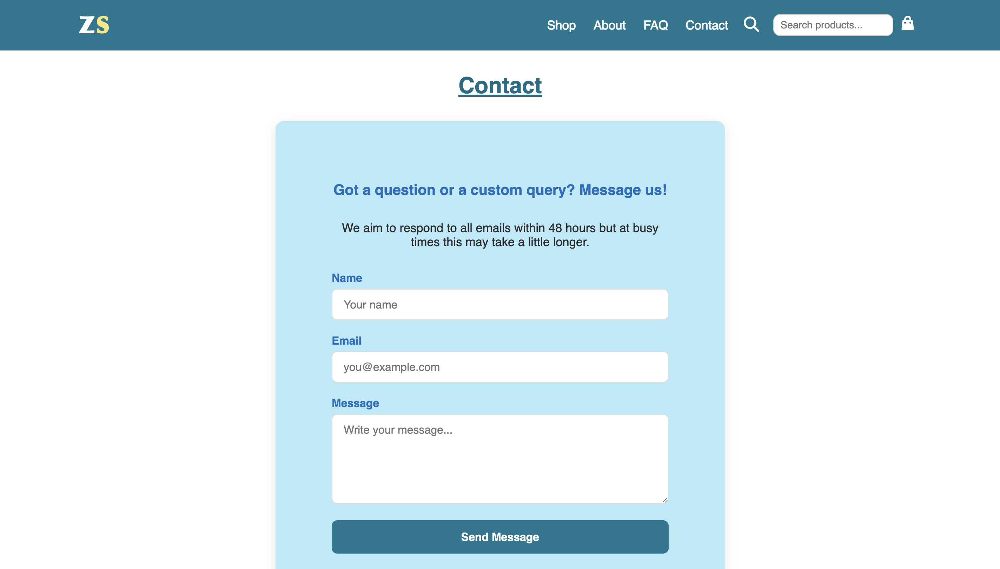
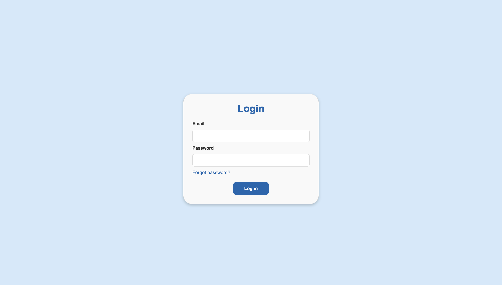
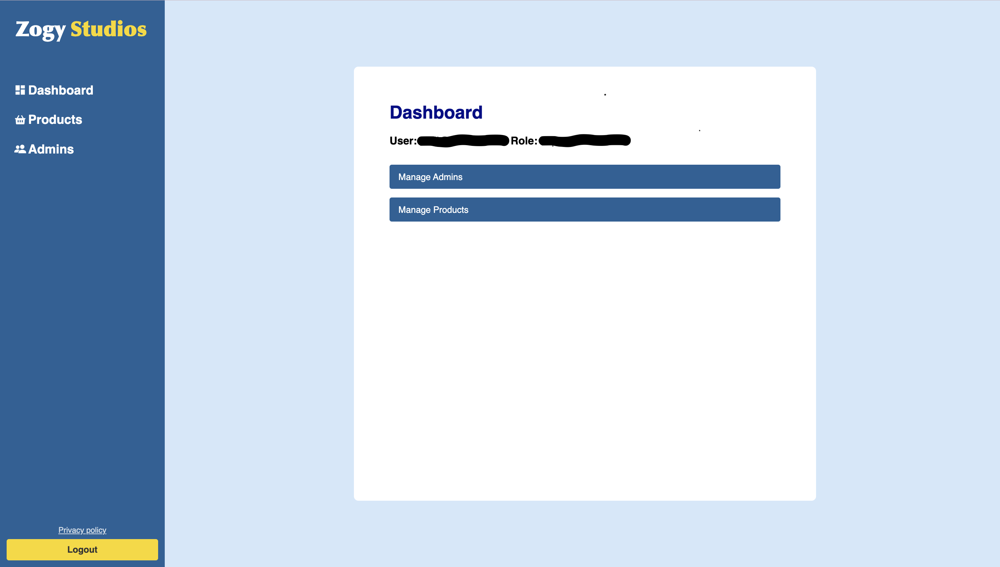
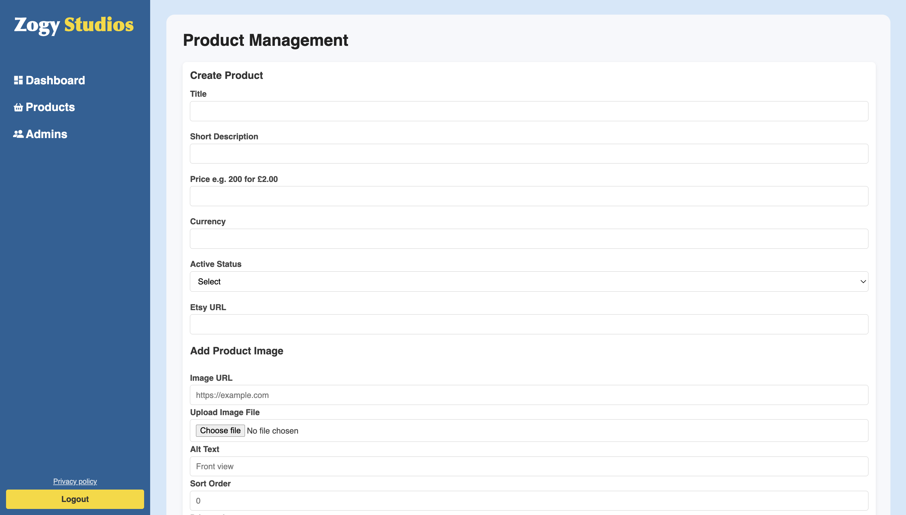
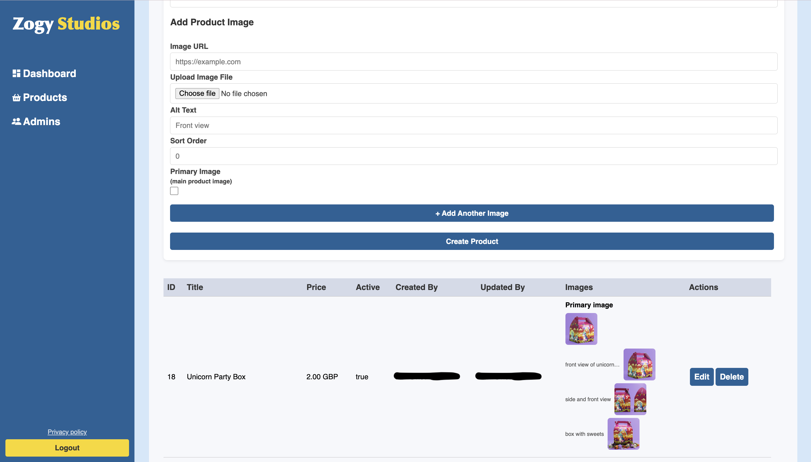

# Zogy Studio Children's Party Box - Client Website

## About the project

My client wanted to expand his successful children's party box business beyond Etsy by creating a website to showcase his products. I developed a website to display the party boxes and support future business growth as the product range expands. 

The primary target users are customers looking to purchase children's party boxes, e.g. parents or guardians. The website allows them to easily browse available party boxes and purchase them through Etsy.

The secondary users are the business owner and administrators who manage the website through the admin backend. They can add new products, update existing listings, delete products, and manage other administrators as the product range expands.

## Features

- Product showcase for customers; allowing them to browse available children's party boxes.

- Etsy integration, allowing customers to purchase boxes via the existing Etsy store.

- Responsive design ensuring the website works on desktop and CSS media queries for smaller screen sizes.

- Secure admin login system allowing authorised users to access to the admin dashboard.

- Admin dashboard for managing the website.

- Product management system allowing administrators to add, edit, view and remove products.

- Multi-admin support; enabling the client to manage additional administrators if needed.

- Contact page allowing customers to connect with the business for additional support and queries.

## Built With

### Frontend
- React
- CSS

### Backend
- Node.js
- Express

### Database and Validation
- PostgreSQL
- Prisma
- Zod

### Infrastructure and Deployment
- Docker
- Terraform 
- AWS S3 (image storage)
- AWS CloudFront
- Render

### CI
- GitHub Actions

## Technical Decisions

- **React** was used to create easy component interfaces for easier management and to reuse UI elements across the website.

- **Prisma** was chosen instead of raw SQL queries to simplify database operations and for safety purposes e.g. preventing SQL injection with user input by using parameterised queries.

- Product images were stored in **AWS S3** for more efficient storage and future scaling of the client's expansion of products.

- **Docker** was used to ensure smooth running of the website in both development and deployed environments.

- **Terraform** was chosen to manage cloud infrastrucutre easily and in a repeatable way.

- **WebAIM** was used to select appropriate colour patterns to ensure accessibility best practises.

## Live Demo

This project was developed for my client and is currently in production.

Live site: 

## Preview

Here is the preview of the website

## Credits

[Host a static website in AWS S3 and CloudFront](https://www.youtube.com/watch?v=bK6RimAv2nQ) - Used to learn the basics setting up the S3 image storage with CloudFront.

[Terraform - Automate your AWS cloud infrastructure](https://www.youtube.com/watch?v=SLB_c_ayRMo) - Used to learn the basics of Terraform.